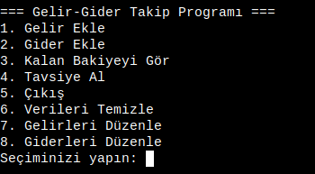

# **Python ile Gelir-Gider Takip Programı**


Bu Python programı, kullanıcıların aylık gelirlerini ve giderlerini kaydetmesine, kalan bakiyeyi hesaplamasına ve **akıllı finansal öneriler almasına** yardımcı olur.

## 🚀 **Özellikler**
✔ Gelir ve gider ekleme  
✔ Kalan bakiyeyi anlık görüntüleme  
✔ Kişisel finans durumuna göre **akıllı tavsiyeler**  
✔ Verileri düzenleme ve temizleme seçeneği  
✔ JSON dosyalarıyla veri kaydetme  

---

## 📥 **Kurulum**  

### **1️⃣ Depoyu Klonlayın**  
Aşağıdaki komutu kullanarak projeyi bilgisayarınıza indirin:  
```bash
https://github.com/can-deliktas/python-gelir-gider-takip.git
cd python-gelir-gider-takip
```

### **2️⃣ Gerekli Bağımlılıkları Yükleyin**  
Bu proje Python 3+ gerektirir. Bağımlılıkları yüklemek için:  
```bash
pip install -r requirements.txt
```

### **3️⃣ Programı Çalıştırın**  
```bash
python3 main.py
```

---

## 🎯 **Kullanım**  
Programı başlattığınızda aşağıdaki menü görüntülenecektir:  
```
=== Gelir-Gider Takip Programı ===
1. Gelir Ekle
2. Gider Ekle
3. Kalan Bakiyeyi Gör
4. Tavsiye Al
5. Çıkış
6. Verileri Temizle
7. Gelirleri Düzenle
8. Giderleri Düzenle
```

## 🖼 **Ekran Görüntüleri**
Aşağıda programın çalışma ekranlarını görebilirsiniz:

**Ana Menü:**  



### 📌 **İşlevler:**
✅ **Gelir Ekle:** `1` seçeneğini seçerek gelir miktarınızı ekleyin.  
✅ **Gider Ekle:** `2` seçeneğini seçerek giderlerinizi kaydedin.  
✅ **Kalan Bakiyeyi Gör:** `3` seçeneği ile güncel mali durumunuzu öğrenin.  
✅ **Tavsiye Al:** `4` seçeneği, **gelir-gider dengenize göre kişiselleştirilmiş öneriler sunar**.  
✅ **Çıkış:** `5` ile programdan güvenli bir şekilde çıkabilirsiniz.  
✅ **Verileri Temizle:** `6` seçeneği, tüm kayıtları sıfırlar.  
✅ **Gelirleri Düzenle:** `7` seçeneği ile yanlış girilen gelir verilerini değiştirebilirsiniz.  
✅ **Giderleri Düzenle:** `8` seçeneği ile giderlerinizi düzenleyebilirsiniz.  

---

## 📂 **Proje Dosya Yapısı**  
```
gelir_gider_takip/
│── README.md                 # Proje dökümantasyonu
│── main.py                   # Ana program
│── requirements.txt           # Gerekli bağımlılıklar
│── data/                      # JSON veri dosyaları
│   ├── gelirler.json          # Kayıtlı gelirler
│   ├── giderler.json          # Kayıtlı giderler
│── src/                       # Programın ana işlevlerini içeren modüller
│   ├── database.py            # Veri okuma/yazma işlemleri
│   ├── hesaplama.py           # Gelir-gider hesaplamaları
│   ├── tavsiyeler.py          # Finansal öneriler
```

---

## 🤖 **Akıllı Tavsiye Sistemi**  
Bu program, **gelir ve giderlerinizi analiz ederek** size finansal durumunuza uygun öneriler sunar:  

💰 **Bakiye < 0 TL** → **Acil önlem alın!** Gelirinizden fazla harcıyorsunuz. Giderleri azaltmalı ve gereksiz harcamaları kısarak borçlanmaktan kaçınmalısınız.  

💳 **0 TL ≤ Bakiye < 500 TL** → **Riskli durum!** Beklenmedik bir harcama karşısında zor durumda kalabilirsiniz. Küçük tasarruflarla acil durum fonu oluşturmaya başlayın.  

📊 **500 TL ≤ Bakiye < 5.000 TL** → **Dengeli bütçe!** Harcamalarınızı kontrol ediyorsunuz. Ancak uzun vadeli yatırımları düşünmek için küçük bir birikim planı yapabilirsiniz.  

📈 **5.000 TL ≤ Bakiye < 20.000 TL** → **Yatırım zamanı!** Harcamalarınızı iyi yönetiyorsunuz. Gelirinizin bir kısmını yatırım araçlarında değerlendirebilirsiniz.  

🏦 **20.000 TL+ Bakiye** → **Finansal özgürlüğe bir adım!** Gelirinizi verimli şekilde yönetiyorsunuz. Profesyonel finansal danışmanlık alarak uzun vadeli yatırımlara yönlenebilirsiniz.  

---

## 🛠 **Önerilen Geliştirmeler**  
Bu proje **açık kaynak** olup, geliştirmeye açıktır! 🎉 Aşağıdaki özellikler eklenebilir:  

✅ **Grafiksel Arayüz (GUI)** → Kullanıcı dostu bir pencere uygulaması  
✅ **Grafik & İstatistikler** → Gelir-gider değişimlerini gösteren görseller  
✅ **Mobil Uygulama Desteği** → Android/iOS için bir versiyon  
✅ **Yapay Zeka Destekli Finansal Öneriler**  

---

## 📢 **Katkıda Bulunma (Pull Request Rehberi)**  
Projeye katkıda bulunmak için şu adımları izleyebilirsiniz:  

### **1️⃣ Depoyu Fork Edin**  
GitHub'da "Fork" butonuna tıklayarak projeyi kendi hesabınıza kopyalayın.  

### **2️⃣ Yeni Bir Branch Açın**  
```bash
git checkout -b yeni-ozellik
```

### **3️⃣ Değişiklikleri Yapın ve Commit Edin**  
```bash
git add .
git commit -m "Yeni özellik eklendi"
```

### **4️⃣ Değişiklikleri Fork’unuza Gönderin**  
```bash
git push origin yeni-ozellik
```

### **5️⃣ Pull Request Gönderin**  
GitHub’a gidin, projenin orijinal deposunu açın ve "New Pull Request" seçeneğiyle kodunuzu incelemeye gönderin.  

---

⭐ Projeye GitHub'da yıldız verin!  

Teşekkürler! 🎉
